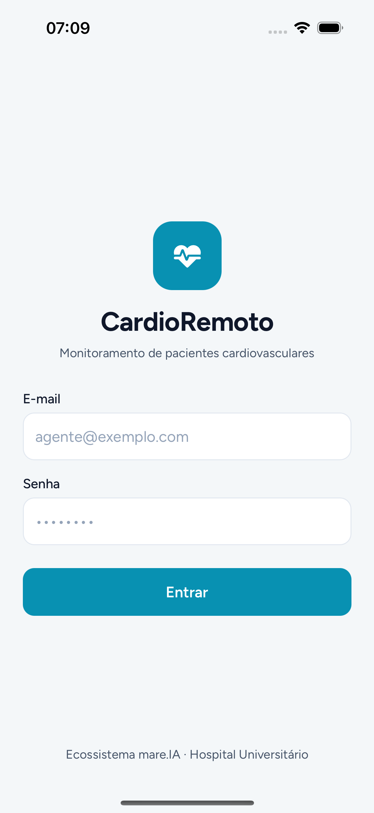
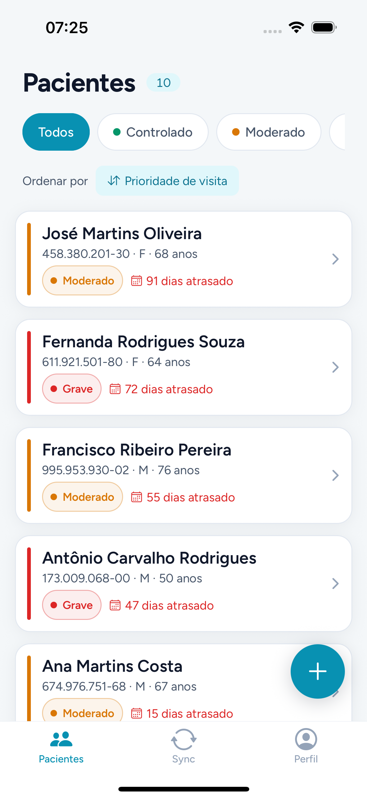
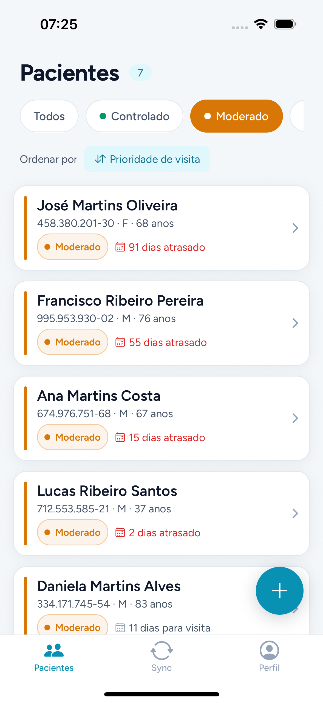
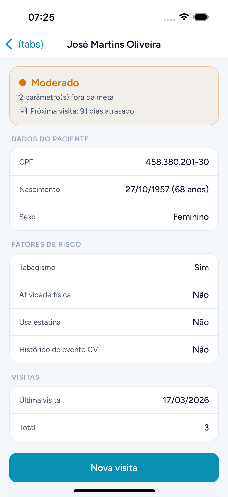
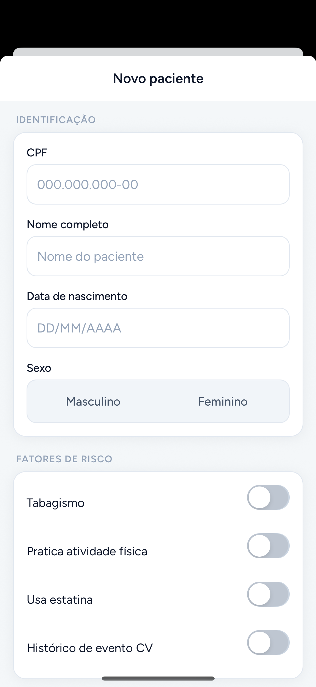
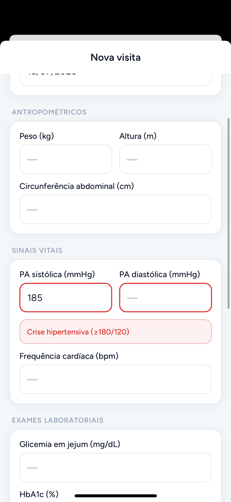
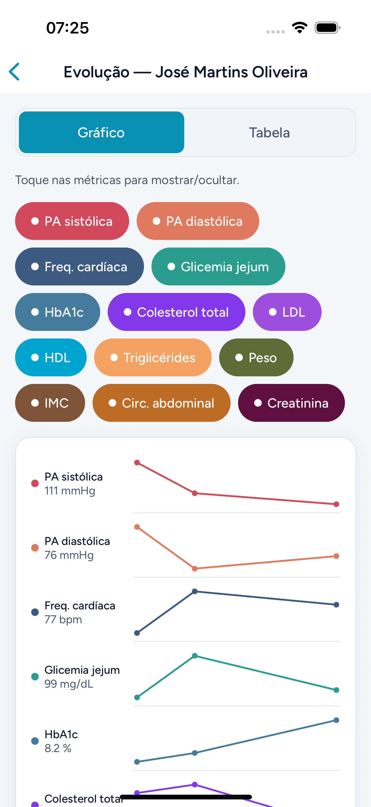
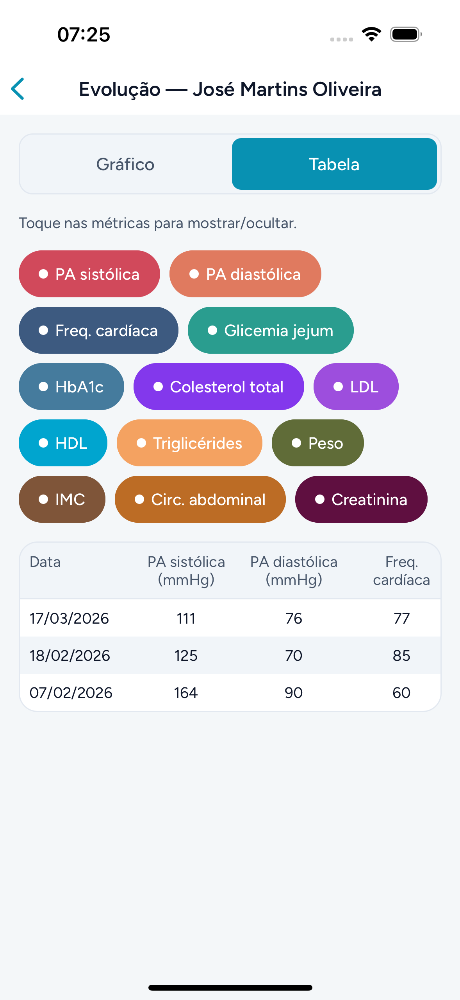
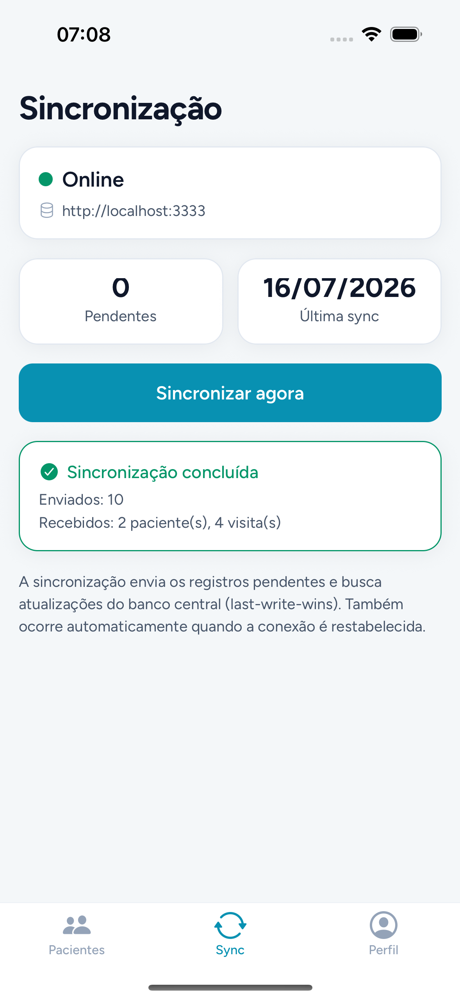
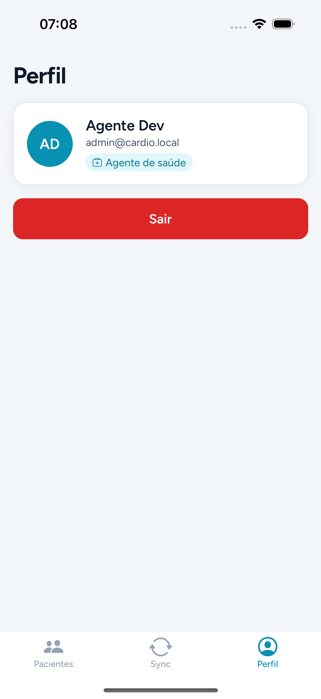

# CardioRemoto

App mobile para monitoramento de pacientes cardiovasculares pelo Hospital Universitário,
parte do ecossistema **mare.IA**. Baseado no Documento de Requisitos V2 (UCE II).

Este repositório é um **monorepo** (npm workspaces) com o app de coleta (Expo/React Native),
o backend de sincronização (banco central) e um pacote de lógica de domínio compartilhada.

## Telas

<table>
  <tr>
    <td align="center" width="33%">
      <br>
      <b>Login</b><br><sub>Acesso do agente (bloqueio após 5 tentativas)</sub>
    </td>
    <td align="center" width="33%">
      <br>
      <b>Pacientes</b><br><sub>Lista com risco, prioridade de visita e ordenação</sub>
    </td>
    <td align="center" width="33%">
      <br>
      <b>Filtro por risco</b><br><sub>Controlado · Moderado · Grave</sub>
    </td>
  </tr>
  <tr>
    <td align="center" width="33%">
      <br>
      <b>Detalhe do paciente</b><br><sub>Classificação de risco + fatores + visitas</sub>
    </td>
    <td align="center" width="33%">
      <br>
      <b>Cadastro de paciente</b><br><sub>CPF validado, idade automática, fatores de risco</sub>
    </td>
    <td align="center" width="33%">
      <br>
      <b>Nova visita</b><br><sub>IMC automático + alertas de valores críticos</sub>
    </td>
  </tr>
  <tr>
    <td align="center" width="33%">
      <br>
      <b>Evolução — gráfico</b><br><sub>Small multiples temporais por métrica</sub>
    </td>
    <td align="center" width="33%">
      <br>
      <b>Evolução — tabela</b><br><sub>Histórico por data</sub>
    </td>
    <td align="center" width="33%">
      <br>
      <b>Sincronização</b><br><sub>Status online, pendências e envio ao banco central</sub>
    </td>
  </tr>
  <tr>
    <td align="center" width="33%">
      <br>
      <b>Perfil</b><br><sub>Agente de saúde e logout</sub>
    </td>
    <td width="33%"></td>
    <td width="33%"></td>
  </tr>
</table>

> Capturas geradas no iOS Simulator (build Release) via Maestro (`e2e/flows/capture*.yaml`).

## Estrutura

```
cardio-remoto/
├── apps/
│   ├── mobile/      # App Expo + React Native (módulo de coleta)
│   └── backend/     # Banco central de sincronização (Node HTTP + node:sqlite, zero deps)
├── packages/
│   └── shared/      # Lógica de domínio pura, compartilhada por app e backend
│                    #   (CPF, datas, IMC, alertas críticos, risco, prioridade, contrato de sync)
├── e2e/
│   ├── flows/       # Jornada completa + subfluxos + captura de telas (Maestro)
│   └── tests/       # Testes granulares por ação (validação, alertas, filtros, logout…)
├── docs/screenshots/
└── DocumentoRequisitosV2.pdf
```

## Design system

Estilo clínico "Accessible & Ethical": cyan calmo (`#0891B2`) + verde de saúde, cores
semânticas de risco (verde/amarelo/vermelho) e tipografia **Figtree**. Tokens em
`apps/mobile/src/theme/tokens.ts` (cores, espaçamento, raio, tipografia, elevação) e uma
biblioteca de componentes reutilizáveis em `apps/mobile/components/ui/` (`Txt`, `Button`,
`Card`, `Badge`, `Chip`, `Field`/`Input`, `SectionCard`, `Stat`, `Screen`).

## Stack

- **Expo SDK 54 + React Native + TypeScript** — app
- **Expo Router** — navegação por arquivo
- **op-sqlite + Drizzle ORM** — banco local offline-first
- **react-hook-form + zod** — formulários e validação
- **TanStack Query + Zustand** — estado
- **react-native-svg** — gráficos de evolução (small multiples)
- **@react-native-community/netinfo** — conectividade + sync passiva
- **Node `node:sqlite` + `node:http`** — backend sem dependências externas
- **Maestro** — testes e2e no simulador

## Requisitos implementados

| Req    | Descrição                                    | Onde |
|--------|----------------------------------------------|------|
| RF001  | Login (bloqueio após 5 tentativas)           | `apps/mobile/src/features/auth` |
| RF002  | Cadastrar paciente (CPF validado, idade auto)| `apps/mobile/app/pacientes/novo.tsx` |
| RF003  | Filtrar pacientes por risco                  | `apps/mobile/app/(tabs)/index.tsx` + `packages/shared/src/risco.ts` |
| RF004  | Ordenar por prioridade de visita             | `packages/shared/src/visita-prioridade.ts` |
| RF005  | Inserir visita (IMC + alertas críticos)      | `apps/mobile/app/pacientes/[id]/visitas/nova.tsx` |
| RF006  | Evolução (tabela + gráfico temporal)         | `apps/mobile/app/pacientes/[id]/evolucao.tsx` |
| RF007  | Sincronização manual                         | `apps/mobile/src/features/sync` + `apps/backend` |
| RFN001 | Offline-first + sync passiva                 | fila `sync_queue` + `usePassiveSync` |
| RFN002 | Interface responsiva                         | `apps/mobile/hooks/use-responsive.ts` |

## Comandos

```bash
npm install              # instala todos os workspaces

# App
npm run start            # Metro (dev)
npm run ios              # build + roda no iOS Simulator

# Backend (banco central)
npm run backend          # inicia em http://localhost:3333 (dev, com --watch)

# Testes
npm test                 # testes unitários (shared) + backend
npm run test:unit        # apenas lógica de domínio compartilhada
npm run test:e2e         # e2e no simulador (Maestro) — sobe backend + build Release + jornada
npm run test:e2e:granular # testes granulares por ação (validação, alertas, filtros, logout…)

# Qualidade
npm run typecheck        # tsc em shared + mobile
npm run lint
```

## Sincronização (contrato)

O app mantém uma `sync_queue` local. O backend é um _document-store_ chaveado por
`(tipo, id)` com resolução **last-write-wins** por `updatedAt` e um cursor monotônico
para pulls incrementais:

- `POST /sync/push` — envia mutações pendentes (merge de payloads parciais)
- `GET  /sync/pull?since=<cursor>` — devolve o que mudou desde o cursor
- `GET  /health` — status + contadores

A URL do backend é configurável via `EXPO_PUBLIC_API_URL` (padrão `http://localhost:3333`).

## Documentos

- [`docs/pitch/index.html`](./docs/pitch/index.html) — pitch de slides (autocontido; abra no navegador)
- [`PLANO.md`](./PLANO.md) — plano de ação, sprints e premissas
- `DocumentoRequisitosV2.pdf` — requisitos originais
